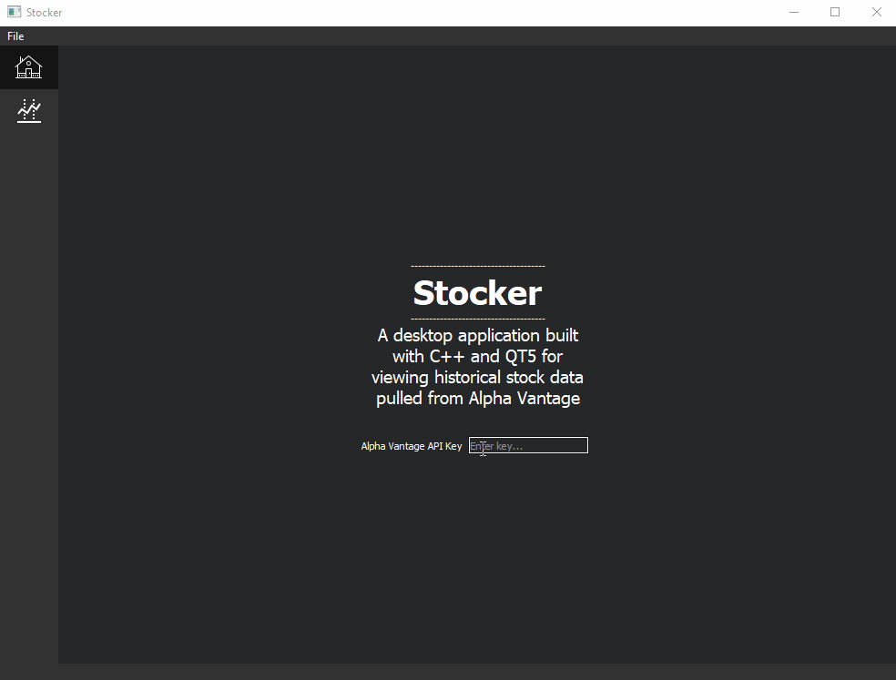
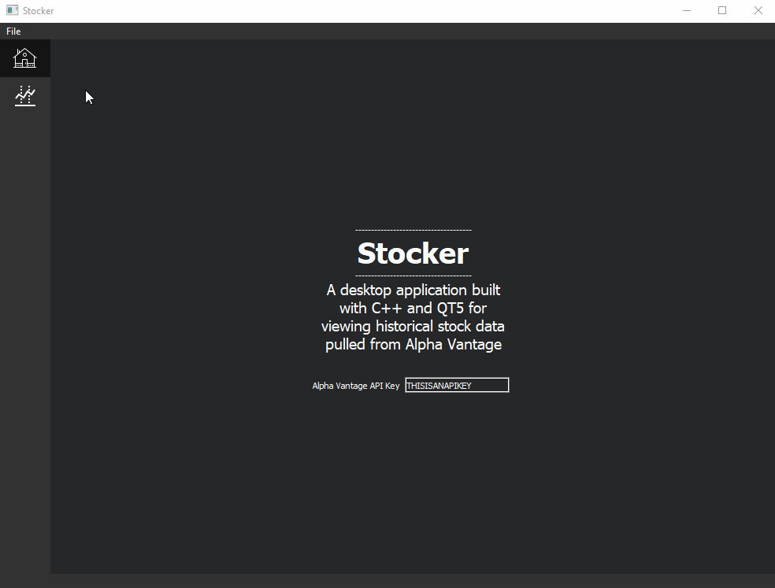
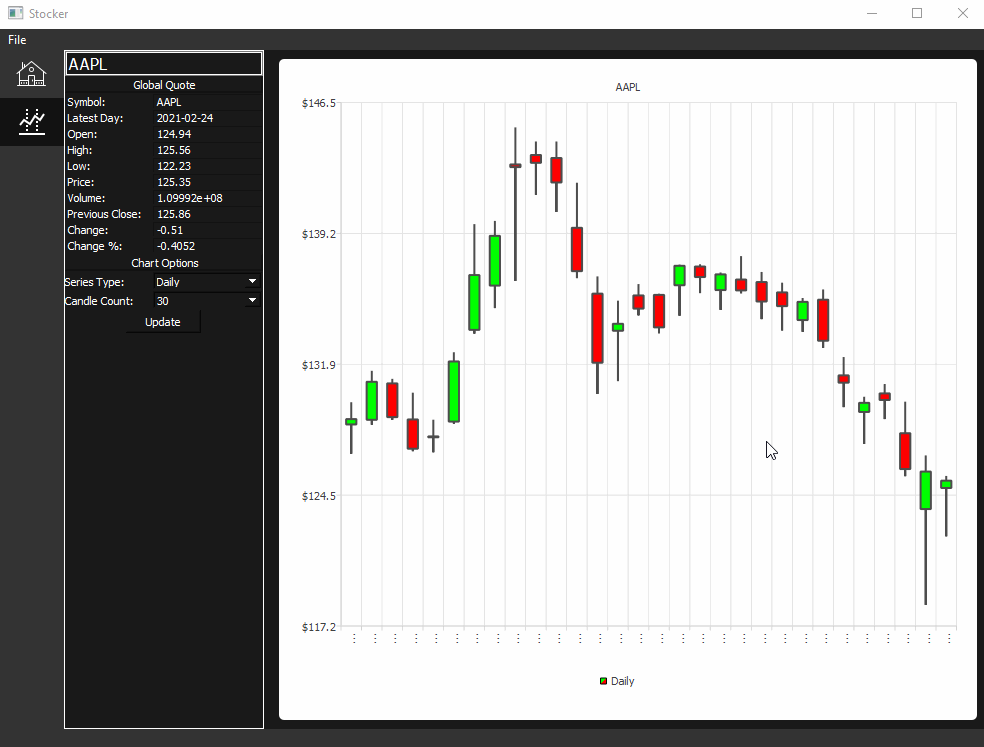
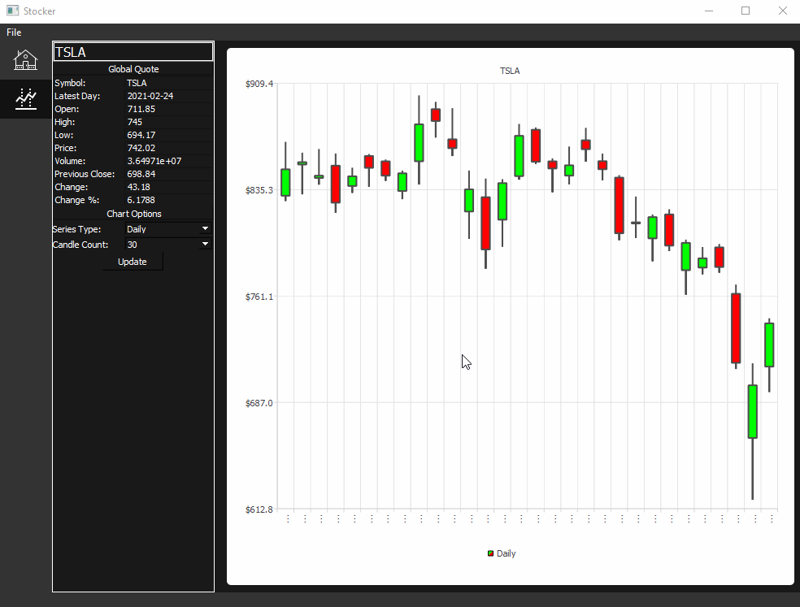

# stocker
A desktop application built with C++ and [Qt](https://www.qt.io/) for viewing historical stock data pulled from [Alpha Vantage](https://www.alphavantage.co/). This application was created to showcase an example implementation of both [avapi](https://github.com/DavidM-Fox/avapi) and [QCandlestickChartView](https://github.com/DavidM-Fox/QCandlestickChartView).

# Prerequisites
Before using stocker, an Alpha Vantage API key must be retrieved from [here](https://www.alphavantage.co/support/#api-key). This key can be saved to an ```api.key``` file within the project root directory or entered on the home page of stocker. In addition, this application requires the following libraries:
* [avapi](https://github.com/DavidM-Fox/avapi)
* [rapidcsv](https://github.com/d99kris/rapidcsv)
* [libcurl](https://github.com/curl/curl)
* [QCandlestickChartView](https://github.com/DavidM-Fox/QCandlestickChartView)

# Demo
## Entering an API Key

By default, stocker will look for ```api.key``` within the project's root directory and read an Alpha Vantage API key from it. The key can be entered on stocker's home page if desired.



## Stock View

On the stock page, a symbol of interest can be entered to display both a global quote and a default daily candlestick series of the past 30 days.



## Changing Symbol of Iterest

The symbol of interest can be changed at will.



## Changing Chart Options

Within the chart options, the series type and candle count can be set to change the chart view.



# About
The icons used in this application were sourced from [https://icons8.com](https://icons8.com).
